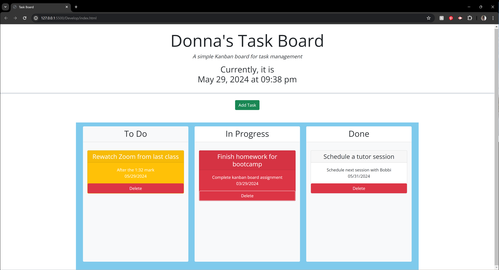

# Donna's Task Board: A Simple Kanban Board for Task Management

## Description

Time and task management during Bootcamp is paramount; using a simple kanban board can help provide structure and accountability for staying focused and keeping your eyes on the prize.

## Usage

To get started, simply click on the green "Add Task" button and enter your task information. As your task status changes, you can manually move it from column to column. The tasks will automatically change color (yellow if they are due today, red if they are overdue). If you need to delete a task, you can just click the delete button and pretend like it was never something you had to do :)

## License

This project is licensed under the MIT license- please see the license for details.

## Contact

donnacancode:
donnacancode@gmail.com
